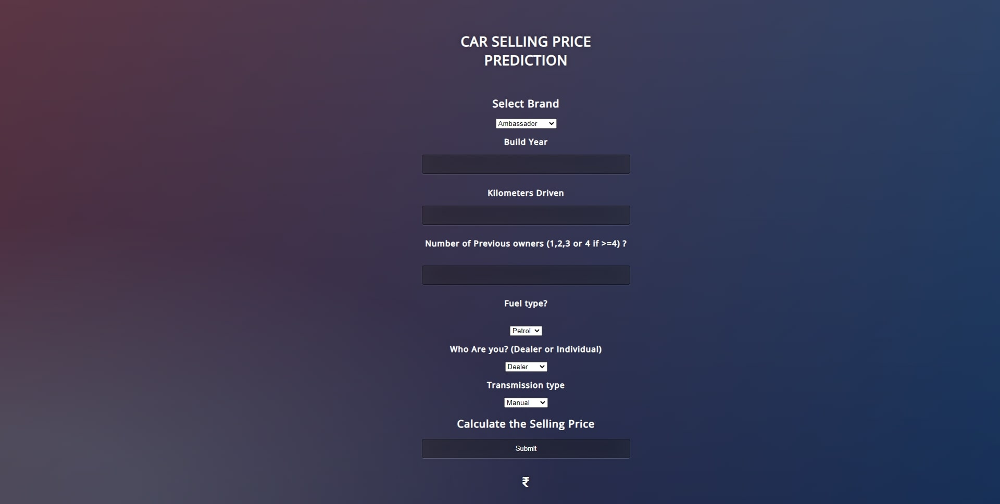
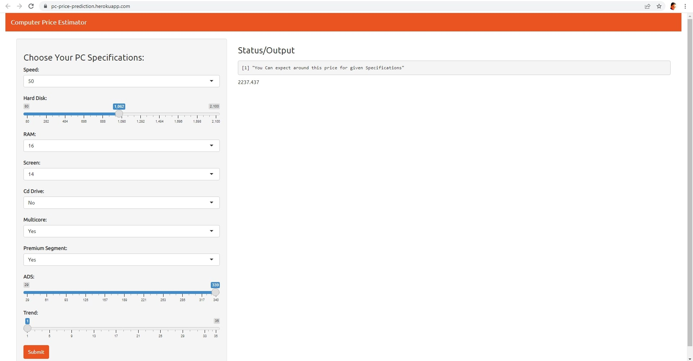
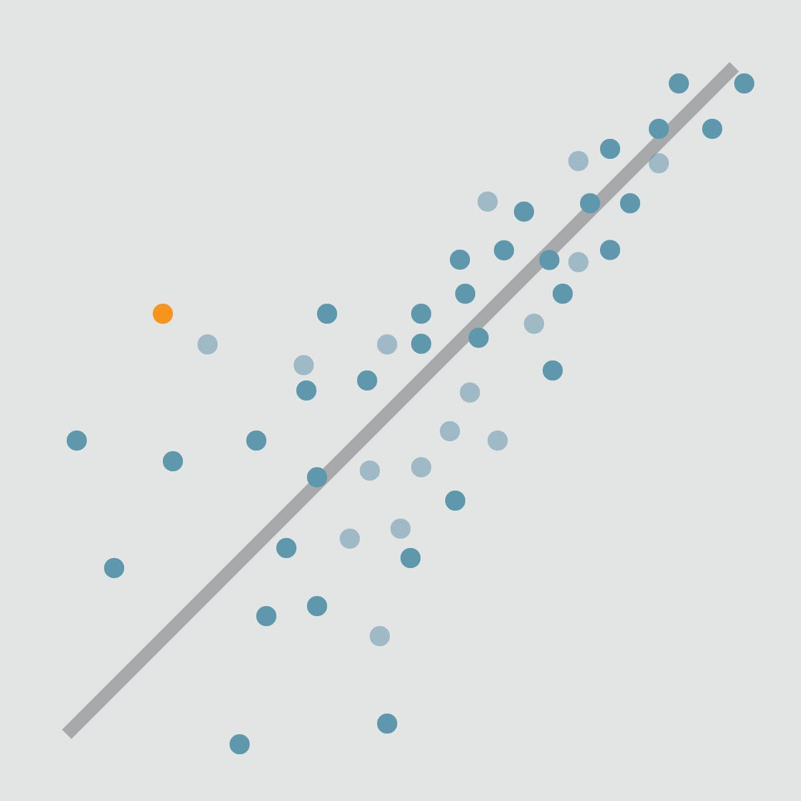

**Ashish Toppo**  
**Nostrum IT Services**  
**Data Scientist**  

**This is my Project Portfolio to showcsae my knowledge and working methodology in the field of Data Science and Machine Learning while working as a Data Scientist.**  
In this web page:  
1. I Have two **Live projects on Heroku** Platform based on similar projects I did for my current employer.  
2. Other Projects to show my knowledge regarding few Machine Learnign Algorithms on Github.  

# Live Projects (Active on Heroku)
# [Project 1: Car Price Prediction]()  
**Type      :Regression**  
**Algorithm :Random Forest**  
**Language  :Python**  
**IDE       :Jupyter Lab**  
 
Problem Statement:  
To make a regressor model by using the his dataset from www.cardekho.com of various cars sold between the year 1993 to 2020.  
**Below is the image of the model when deployed**  

  

Use This [link]() to go to the app.  

# [Project 2: Computer Price Prediction](https://github.com/Tashish97/Model1)  
**Type      :Regression**  
**Algorithm :Random Forest**  
**Language  :R**  
**IDE       :RStudio,RShiny**  
 
Problem Statement:  
To make a regressor model by to predict the price of computer as per the specifications given through RShiny Interface.  
This data can be used for a lot of purposes such as price prediction to exemplify the use of linear regression in Machine Learning.  

**Below is the image of the model when deployed**   

  

Use This [link]() to go to the app.  

# Other Projects on GitHub
# [Insurance Forecast ](https://github.com/Tashish97/Linear-Regression)  
**Type      :Regression**  
**Algorithm :Linear Regression**  
**Language  :R**  
**IDE       :RStudio**  

Description:
A Linear Regression Model with validating its assumptions.
Linear Regression is all about finding the best fit line.

This is project in which I applied Linear Regression Model, validating it's assumptions which are:
1. **Linearity** : This assumption assumes that each indepedent variable has a linear relationship with the Dependent Variable.
2. **Homoscedastity** : This assumption states that the residuals have less variance in residuals.
3. **Non-Multicollinearity** : This assumptions tells that the independent features must ne non-collinear.
4. **Normailty** : This assumptio states that the residuals are normally distributed.  

## Work Done:
1. EDA on independent variable(s) and dependent variable and answering a few questions as per my knowledge using various visulizational techniques.
2. Wrote custom functions for various repetitive tasks.
3. Linearity assumption check on each independent variable.
4. Handling of outliers.
5. Removal of columns which do not satisfy the linear regression assumptions.
6. Validation of model using R-Square and residual plot. 

# [Social Network Ads ](https://github.com/Tashish97/SVM)  
**Type      :Classification**  
**Algorithm :SVM(Support Vector Machines)**  
**Language  :R**  
**IDE       :RStudio**  

Description:
Using this data set I need to predict the whether a person will buy the product after seeing the advertisement. SVM is to find a line or a hyperplane which separates the data into classes. An SVM algorithm should not only place objects into categories, but have the margins between them on a graph as wide as possible.

## Work Done:
1. EDA on independent variable(s) and dependent variable and answering a few questions as per my knowledge by using various visulizational techniques.
2. Feature Engineering using medical domain knowledge.
3. Data encoding with custom function for Normalization.
4. Hyperparameter tuning to find best parameters.
5. Validation of model using AUC_ROC and Confusion Matrix.

# [Spam Filter](https://github.com/Tashish97/Naive-Bayes-NLP-)  
**Type      :NLP**  
**Algorithm :Naive Bayes**  
**Language  :Python**  
**IDE       :Jupyter Lab**  

Description:
Naive Bayes classifier assumes that the presence of a particular feature in a class is unrelated to the presence of any other feature. For example, a fruit may be considered to be an apple if it is red, round, and about 3 inches in diameter. It's based on bayes theorem.  

  
## Work Done:  
1. Cleaned the text:
1.1 Removed the Punctuations using regex.
1.2 Removed the stop words.
1.3 Rooted the words using lemmatization
2. Converted the text data to both bag of words data and tfidf data.
3. Done hyperparameter tuning using GridSearchCv for both bow and tfidf data.
4. Confusion matrix and ROC-AUC curve for validation.

# [Clustering of Customers](https://github.com/Tashish97/KMeans)
**Type      :Clustering**  
**Algorithm :Kmeans**  
**Language  :Python**  
**IDE       :Jupyter Lab**  

Description:  
A Small Project to show how to implement Kmeans.  
k-means clustering tries to group similar kinds of items in form of clusters. It finds the similarity between the items and groups them into the clusters.  

## Work Done:  
1. Preparation of data.  
2. Visualization of variables.  
3. Use of **Elbow Metohd and WCSS** to find optimum number of clusters.  
4. Applying best found number of cluster=**5**.  
5. Validating the performance of the model using scatter plot.  
