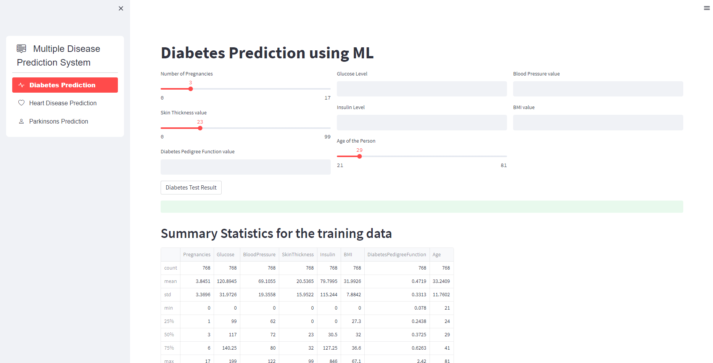
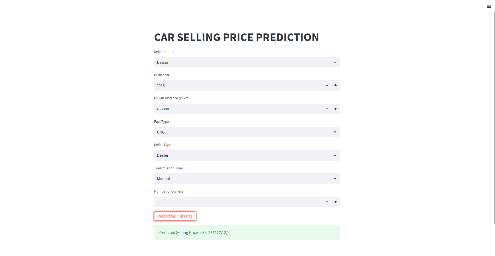
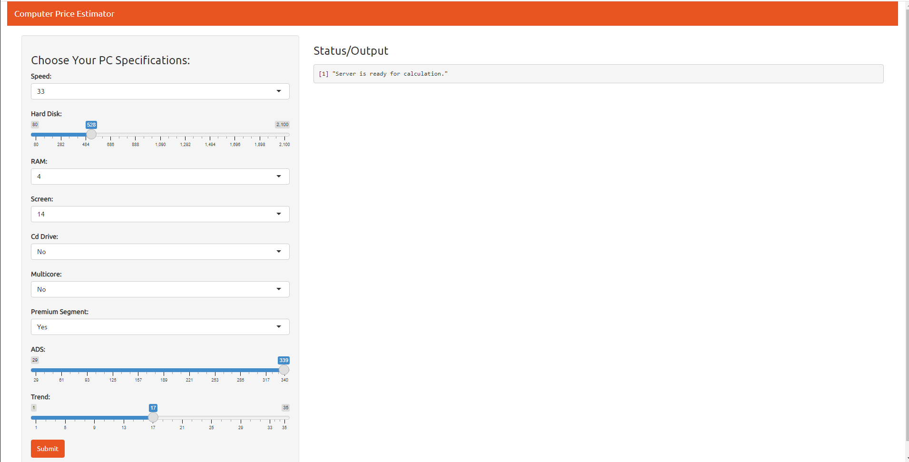

**Ashish Toppo**  
**Data Scientist**  

**Who Am I ?**   
1. An Avid Data Scientist with 1 year of Experience.
2. A learner with strong background in developing predictive models in Python.
3. Dashboard Developer in Streamlit, Power BI and basic web apps in R/Shiny. 

**In this page you will find:**  
1. **3** **Live End to End Machine Learning projects** with titles as hyperlinks to those **Projects**, click on **Live Link** to go to the deployed application.  
2. **2** **SQL Data analysis** projects, using sql queries to solve/explore data in Jupyter Notebook environment, with titles as hyperlinks to those **Projects**.  
3. **All these projects show my understanding and my approach to solve a data science/analytics problem**.  
4. Other Projects to show my knowledge on few but not limited, Machine Learning Algorithms on Github.  
5. Click on the **Title of Projects** to go to their respective GitHub Repositories.  

# [Project 1: Multi Disease Prediction System](https://github.com/Tashish97/multiDiseasePredict)
**Type      :Classification, Regression**   
**Language  :Python**  
**Skills    :SVM, Logistic Regression, Streamlit**  
 
Problem Statement:  
To make an One Stop Web based application in Streamlit which gives access to **3 Types of disease prediction** which are as follows:  
1. Diabetes Prediction  
2. Heart Disease Prediction  
3. Parkinson's Prediction  
  
  This is a multipage application, giving users the ability to predict the above diseases in a single app.  

**Click link Below to go to live dashboard!!**   
## [Live Link](https://tashish97-multidiseasepredict-app-z1stmq.streamlit.app/)  

  

# [Project 2: Car Price Prediction](https://github.com/Tashish97/Car_Price_Prediction_v2)
**Type      :Regression**  
**Language  :Python**  
**Skills    :Jupyter Lab, Random Forest, Accuracy, Streamlit**  
 
Problem Statement:  
To make a regressor model by using the his dataset from www.cardekho.com of various cars sold.  
  
**Click link Below to go to the deployed model in a live web application!!**   
## [Live Link](https://cpp-sqg7.onrender.com/)  

  

# [Project 3: Computer Price Prediction](https://github.com/Tashish97/Model1)
**Type      :Regression**  
**Language  :R**   
**IDE       :RStudio, RShiny, RShiny Widgets, Random Forest**  
 
Problem Statement:  
To make a regressor model to predict the price of computer as per the specifications given through RShiny Interface.  
This data can be used for a lot of purposes such as price prediction to exemplify the use of linear regression in Machine Learning.  

**Click link Below to go to the deployed model in a live web application!!**   
## [Live Link](https://tashish97.shinyapps.io/computerpp/)  

  

# SQL Projects  
  
Following are 2 SQL Projects, where I tried doing data analysis to get some insights about datasets .  

**Project Name**  | **Description**   |  **Topics**
------------- | ------------- | ------------------
[Spotify Music Data Analysis](https://github.com/Tashish97/sql-projects/tree/main/music-store-sql)  | `Explored spotify data to answer a list of questions to get information about genres, contries and many factors.` | data manipulation, joins, subqueries, correlated subqueries, window function and case
[International Debt Statistics](https://github.com/Tashish97/sql-projects/tree/main/international-debt)  | `Wrote SQL queries to answer statistical questions about international debt data from The World Bank`  | data manipulation, importing and cleaning data  
  
  

# Other Machine Learning Projects on Github  

**Project Name**  | **Algorithm**    
------------- | ------------- 
[Insurance Forecast ](https://github.com/Tashish97/Linear-Regression)  | Linear Regression  
[Social Network Ads ](https://github.com/Tashish97/SVM)  |  SVM  
[Spam Filter](https://github.com/Tashish97/Naive-Bayes-NLP-)  |  Naive Bayes 
[Clustering of Customers](https://github.com/Tashish97/KMeans)  | Kmeans  
